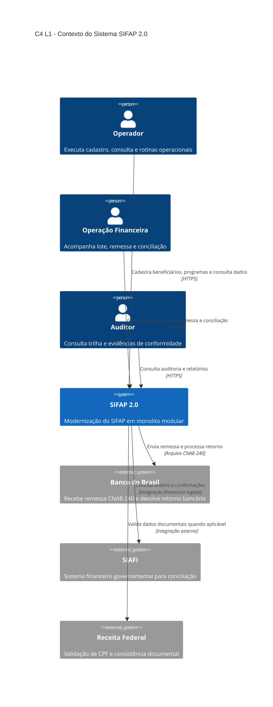
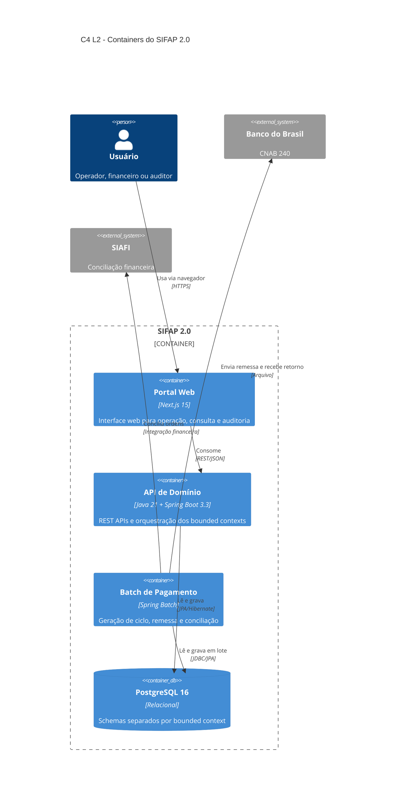
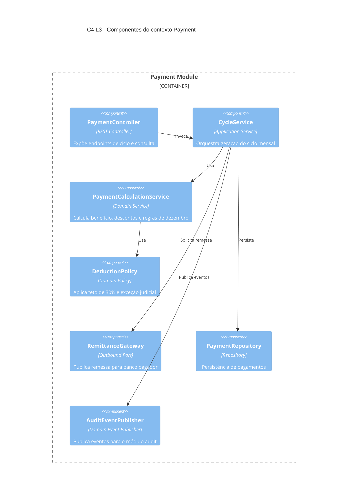

# C4 Diagrams — SIFAP 2.0

**Versão:** 0.1.0  
**Data:** 20/05/2026  
**Responsável:** Par 2 — Enterprise Architect + Software Architect

Este documento consolida a visão arquitetural do SIFAP 2.0 para a passagem H2.
Os diagramas abaixo refletem a spec vigente, os bounded contexts identificados no
Estágio 1 e as restrições operacionais do workshop.

## Premissas arquiteturais

- O sistema será entregue como um monolito modular.
- Os bounded contexts identificados são `beneficiary`, `payment`, `admin` e `audit`.
- O fluxo operacional crítico continua centrado no ciclo mensal de pagamento.
- A integração financeira legada com arquivos de remessa e retorno permanece uma restrição de desenho.
- A trilha de auditoria é requisito transversal e não pode ser tratada como detalhe opcional.

## Mapeamento de bounded contexts

| Contexto | Responsabilidade principal | Evidência legada principal |
|----------|-----------------------------|----------------------------|
| `beneficiary` | cadastro, documentação, status e dependentes | `BENEFICIARIO`, `CADBENEF.NSN`, `CADDEPEND.NSN`, `VALDOCS.NSN` |
| `payment` | geração de ciclo, cálculo, descontos, correção e conciliação | `PAGAMENTO`, `BATCHPGT.NSN`, `CALCBENF.NSN`, `CALCDSCT.NSN`, `CALCCORR.NSN`, `BATCHCON.NSN` |
| `admin` | cadastro e parametrização de programas sociais | `PROGRAMA-SOCIAL`, `CADPROG.NSN`, `VALELEG.NSN` |
| `audit` | registro e consulta de eventos de auditoria | `AUDITORIA`, `RELAUDIT.NSN` |

## Regras de fronteira

1. Um contexto não importa classes de infraestrutura de outro contexto.
2. Comunicação entre contextos ocorre por interfaces de aplicação ou eventos de domínio publicados internamente.
3. Cada contexto possui dono claro dos dados e seu próprio conjunto de tabelas no PostgreSQL.
4. O contexto `audit` é append-only e não recebe atualizações destrutivas.
5. O batch de pagamento pode consultar dados de `beneficiary` e `admin` por contratos explícitos, nunca por acesso direto a repositórios externos.

## C4 L1 — Contexto do sistema

## C4 L2 — Containers

## C4 L3 — Componentes do contexto `payment`

## Observações para o handoff H2

- O Par 3 deve usar estes diagramas como referência de fronteira, não como licença para criar camadas genéricas sem dono de domínio.
- O contexto `payment` é o núcleo P0 e concentra o maior risco de regressão funcional.
- O contexto `admin` precisa preservar a semântica do FATOR-K definida em REQ-ADM-004.
- O contexto `audit` é transversal, mas não deve virar um atalho para acoplamento entre módulos.