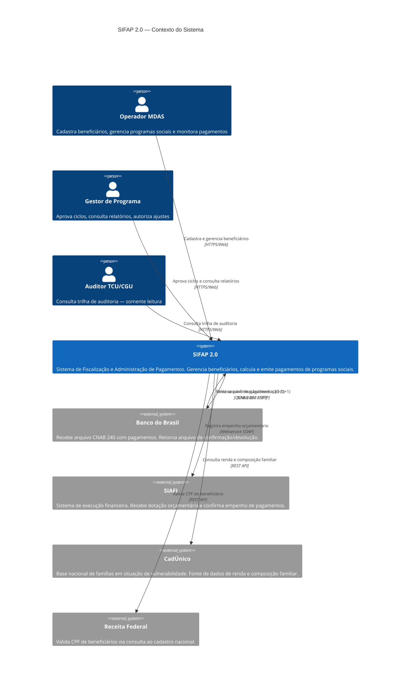
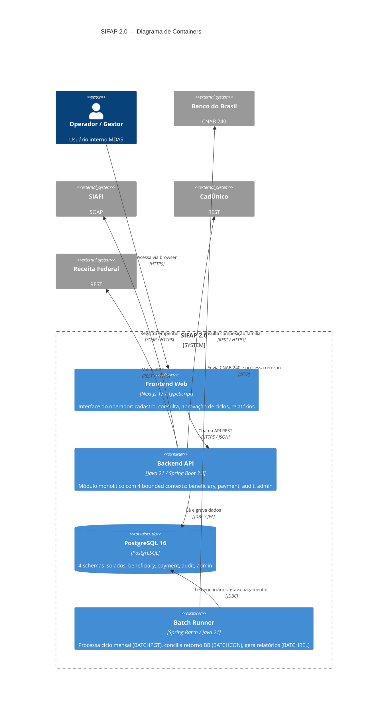
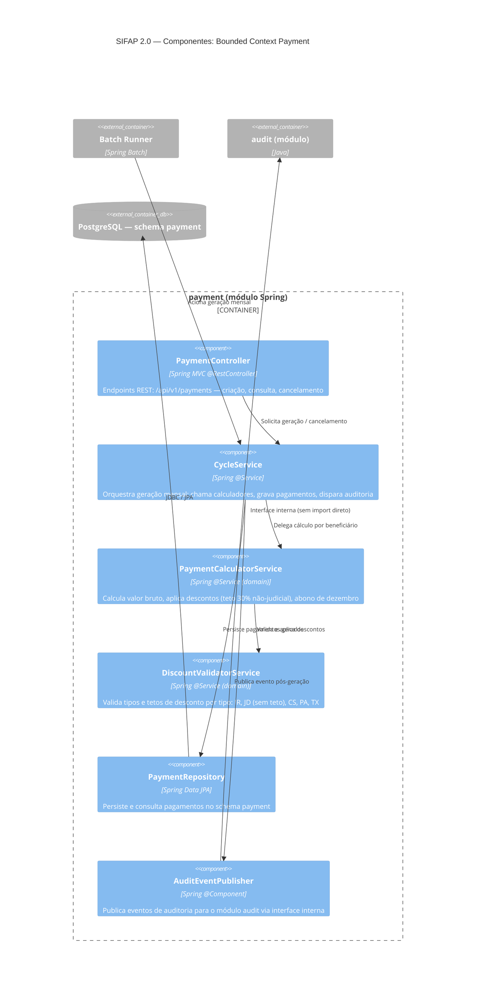

# Diagramas C4 — SIFAP 2.0

**Responsável:** Par 2 · Arquitetura (Enterprise Architect + Software Architect)
**Status:** Rascunho — aguardando validação no H2 com Par 3 e Par 4
**Data:** 20/05/2026

> Estes diagramas foram produzidos com base na leitura dos DDMs (BENEFICIARIO, PAGAMENTO,
> AUDITORIA, PROGRAMA-SOCIAL) e dos programas BATCHPGT.NSN e BATCHCON.NSN.
> O Par 1 (Visão) deve validar escopo antes da Passagem H2.

---

## Nível 1 — System Context (C4 L1)

Responsabilidade: Enterprise Architect
Pergunta respondida: "Quem usa o SIFAP e com quem ele se comunica?"

### Integrações críticas identificadas no legado

| Sistema externo    | Programa legado     | Protocolo legado | Protocolo moderno proposto |
|--------------------|---------------------|------------------|---------------------------|
| Banco do Brasil    | BATCHCON.NSN        | CNAB 240 / SFTP  | CNAB 240 / SFTP (mantido) |
| SIAFI              | BATCHPGT.NSN (DDM)  | Webservice SOAP  | REST ou SOAP (ver ADR-002) |
| CadÚnico           | VALBENEF.NSN        | Batch file       | REST API                  |
| Receita Federal    | VALBENEF.NSN        | Módulo 11 local  | REST API + fallback local  |

> **Risco identificado (EA):** Integração com SIAFI via SOAP é contrato de 2002 (ver DDM PAGAMENTO campo integracao-siafi). Qualquer mudança exige janela de manutenção coordenada. Ver ADR-002.

---

## Nível 2 — Container Diagram (C4 L2)

Responsabilidade: Software Architect
Pergunta respondida: "Quais são os containers do SIFAP 2.0 e como se comunicam?"

---

## Nível 3 — Component Diagram (C4 L3) — Bounded Context: Payment

Responsabilidade: Software Architect
Pergunta respondida: "Como o contexto Payment é organizado internamente?"

---

## Regras de Fronteira entre Módulos (SA)

> Estas regras serão validadas por ArchUnit no CI (ver ADR-001).

| Regra | Descrição |
|-------|-----------|
| R1 | Nenhum módulo importa classes do pacote `infrastructure` de outro módulo |
| R2 | Comunicação entre módulos ocorre exclusivamente via interfaces declaradas em `domain/` |
| R3 | Cada módulo possui schema PostgreSQL próprio e não faz JOIN em tabelas de outro schema |
| R4 | O módulo `audit` não recebe dependência direta de nenhum módulo — apenas publica eventos |
| R5 | O módulo `payment` referencia `beneficiary` somente via CPF (chave de negócio), nunca via entidade JPA |

---

## Bounded Contexts — Definição

| Contexto      | Origem no legado       | Responsabilidade no SIFAP 2.0                        | Entidades principais                |
|---------------|------------------------|------------------------------------------------------|-------------------------------------|
| `beneficiary` | DDM BENEFICIARIO       | Cadastro e validação de beneficiários                | Beneficiary, Dependent, Address     |
| `payment`     | DDM PAGAMENTO          | Ciclo de pagamento, descontos, conciliação bancária  | Payment, Cycle, Discount, BankReturn |
| `audit`       | DDM AUDITORIA          | Trilha imutável de todas as alterações (lei TCU)     | AuditEntry (append-only)            |
| `admin`       | DDM PROGRAMA-SOCIAL    | Parâmetros de programas sociais, regras de elegibilidade | SocialProgram, EligibilityRule   |

> **Nota SA:** o `FATOR-K` (campo BG do DDM PROGRAMA-SOCIAL, inserido em 2008 sem documentação)
> pertence ao contexto `admin` mas sua lógica de cálculo precisa ser investigada pelo Par 1 antes de
> especificar REQ-IDs. Marcar como mistério em `01-arqueologia/mysteries-found.md`.
