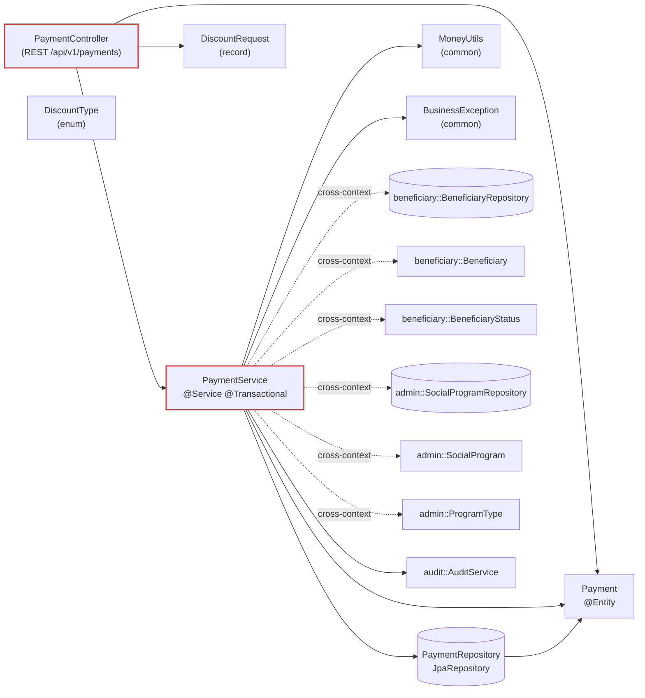

<!-- markdownlint-disable MD013 MD025 MD033 MD040 -->

# Mapa de código — payment

> Última revisão: 2026-05-20 — owner: Par 2 · Software Architect — mapa em nível de serviço.
> Spec vinculada: [specs/002-geracao-ciclo-pagamento/spec.md](../specs/002-geracao-ciclo-pagamento/spec.md)
> ADRs base: [ADR-001](../02-spec-moderna/ADR-001-monolito-modular.md) · [ADR-003](../02-spec-moderna/ADR-003-auditoria-imutavel.md) · [ADR-004](../02-spec-moderna/ADR-004-parametrizacao-constantes-financeiras.md) · [ADR-005](../02-spec-moderna/ADR-005-paridade-vs-determinismo-descontos.md) · [ADR-006](../02-spec-moderna/ADR-006-contratos-identificadores.md)

## 1. Diagrama de componentes

Linhas tracejadas marcam **dependências cross-context** atualmente importadas como classes concretas — viola a regra 1 do [ADR-001](../02-spec-moderna/ADR-001-monolito-modular.md) ("um contexto não importa classes de infraestrutura de outro contexto").

## 2. Componentes

| Tipo | FQN | Papel | REQ-IDs | Entrada (inbound) | Saída (outbound) |
|---|---|---|---|---|---|
| controller | [com.sifap.payment.PaymentController](../src/main/java/com/sifap/payment/PaymentController.java) | Adaptador REST `/api/v1/payments`, `/cycles`, `/{id}/discounts`, `/{id}/corrections` | REQ-PAY-001, REQ-PAY-002, REQ-PAY-003, REQ-PAY-004, REQ-PAY-005 | (HTTP) | PaymentService, Payment, DiscountRequest |
| service | [com.sifap.payment.PaymentService](../src/main/java/com/sifap/payment/PaymentService.java) | Orquestração: gerar ciclo, aplicar descontos, correção retroativa | REQ-PAY-001..005 | PaymentController | PaymentRepository, BeneficiaryRepository, SocialProgramRepository, AuditService, MoneyUtils, BusinessException |
| domain/jpa | [com.sifap.payment.Payment](../src/main/java/com/sifap/payment/Payment.java) | Entidade JPA `payment` (id, ciclo, gross/net, descontos, 13º, abono) | REQ-PAY-003 (campos thirteenth/christmasBonus) | Service, Controller, Repository | (DB) |
| repository | [com.sifap.payment.PaymentRepository](../src/main/java/com/sifap/payment/PaymentRepository.java) | JpaRepository com `findByCycleOrderByBeneficiaryCpfAsc` | REQ-PAY-005 (ordenação) | PaymentService | (DB `payment`) |
| dto | [com.sifap.payment.DiscountRequest](../src/main/java/com/sifap/payment/DiscountRequest.java) | Record `(type, amount)` | REQ-PAY-001, REQ-PAY-002 | Controller → Service | — |
| value | [com.sifap.payment.DiscountType](../src/main/java/com/sifap/payment/DiscountType.java) | Enum `J / TAX / PENSION / OTHER` | REQ-PAY-002 | Service, DiscountRequest | — |

Sem testes para `PaymentController` ainda — apenas [PaymentServiceTest](../src/test/java/com/sifap/payment/PaymentServiceTest.java) cobre os REQ-PAY-001..005.

## 3. API pública

| Método | Path | REQ-ID | Testado por |
|---|---|---|---|
| `POST` | `/api/v1/payments/cycles?cycle=YYYY-MM&programId=…` | REQ-PAY-003, REQ-PAY-005 | `PaymentServiceTest#geraCiclo*` (somente service, sem MockMvc) |
| `GET` | `/api/v1/payments?cycle=YYYY-MM` | REQ-PAY-005 | — sem teste |
| `POST` | `/api/v1/payments/{id}/discounts` | REQ-PAY-001, REQ-PAY-002, REQ-PAY-004 | `PaymentServiceTest` (descontos) |
| `POST` | `/api/v1/payments/{id}/corrections?factor=…` | REQ-PAY-004 | `PaymentServiceTest` (correção retroativa) |

⚠️ Endpoints retornam `Payment` (entidade JPA) diretamente — sem DTO de resposta. Gera vazamento de modelo de persistência na API e quebra do contrato em [contracts/openapi.yaml](../specs/002-geracao-ciclo-pagamento/contracts/) ao mudar o schema.

## 4. Estado persistente

- `payment` — uma linha por (beneficiário, ciclo). Index `idx_payment_cpf` em `beneficiary_cpf` (REQ-PAY-005).
- **Faltando:** `cycle_execution` (métricas de ciclo) descrita em [plan.md](../specs/002-geracao-ciclo-pagamento/plan.md#módulos-envolvidos-monólito-modular).
- Trilha de auditoria delegada a `audit::AuditEntry` via `AuditService.record(...)` (ADR-003).
- Sem migration Flyway visível em `src/main/resources/db/migration/` — schema atualmente derivado por Hibernate `ddl-auto`.

## 5. Linhagem legada

| Componente Java | Substitui |
|---|---|
| `PaymentService.generateCycle` | [BATCHPGT.NSN](../01-arqueologia/legado-sifap/natural-programs/BATCHPGT.NSN) |
| `PaymentService.applyDiscounts` (cap 30 % + judicial) | [CALCDSCT.NSN](../01-arqueologia/legado-sifap/natural-programs/CALCDSCT.NSN) |
| `PaymentService.applyRetroactiveCorrection` | [CALCCORR.NSN](../01-arqueologia/legado-sifap/natural-programs/CALCCORR.NSN) |
| dezembro + programa A (13º + abono) em `generateCycle` | [CALCBENF.NSN](../01-arqueologia/legado-sifap/natural-programs/CALCBENF.NSN) |
| `PaymentRepository.findByCycleOrderByBeneficiaryCpfAsc` | ordenação CPF de [BATCHCON.NSN](../01-arqueologia/legado-sifap/natural-programs/BATCHCON.NSN) |

## 6. Smells observados

> Status atualizado em 2026-05-20 após emissão de ADR-004, ADR-005 e ADR-006. Smells fechados arquiteturalmente — ainda exigem PR de implementação pelo Par 3.

### 6.1 Bloqueadores de arquitetura (resolvidos por ADR-001 + ADR-006)

1. ✅ **Pacote raiz errado** — ADR-006 § Plano de adoção, passo 1: rename `com.sifap` → `br.gov.sifap`.
2. ✅ **Layout flat por feature** — ADR-001 + [H2-RESPOSTAS-PAR2 Q1](../02-spec-moderna/H2-RESPOSTAS-PAR2.md#q1--como-a-estrutura-de-módulos-vai-evitar-importações-cruzadas-de-infraestrutura) prescrevem `domain/application/infrastructure`.
3. ✅ **Cross-context import direto** — Q1 fixa `BeneficiaryQueryPort` e `SocialProgramQueryPort`; ArchUnit no `mvn verify` rejeita regressão.
4. ✅ **Domínio acoplado a JPA** — ADR-006 § D-D + Q1: agregado puro em `payment.domain`, mapeamento em `payment.infrastructure.persistence`.
5. ✅ **Controller devolve entidade JPA** — ADR-006 § D-D: `Payment` exposto via DTO com campos split `judicial/nonJudicial/total`.

### 6.2 Riscos funcionais (resolvidos arquiteturalmente)

6. ✅ **Constantes hardcoded** (`0.30`, `0.15`) — ADR-004 introduz `SifapFinancialProperties`.
7. ✅ **FATOR-K não consumido** — ADR-004 + REQ-ADM-004: `SocialProgramService` aplica fórmula com `properties.factorKConstant`.
8. ✅ **`CycleExecution` ausente** — Plano da spec 002 atualizado para criar a entidade na migration baseline.
9. ✅ **`@Transactional` aninhado com `AuditService`** — [H2-RESPOSTAS-PAR2 Q2](../02-spec-moderna/H2-RESPOSTAS-PAR2.md#q2--como-será-garantida-a-imutabilidade-de-auditoria-no-banco-e-na-aplicação): `Propagation.REQUIRES_NEW` ou listener pós-commit.
10. ⚠ **God-method `generateCycle`** — fica como dívida pós-PR estrutural (extrair `CycleEligibilityFilter` + `BonusCalculator`).
11. 🆕 **Cap de descontos order-dependent no legado** — ADR-005 + REQ-PAY-006 (a inserir pelo Par 1) formalizam divergência intencional. Property-based test obrigatório.

### 6.3 Anotações faltando (mantidas como dívida)

12. ⚠ **Sem `@implements REQ-NNN`** — manter como dívida; resolver junto com primeiro PR de feature.
13. ⚠ **Cobertura de teste no controller layer** — Par 4 (QA) escreve MockMvc no PR estrutural.

## 7. Recomendações priorizadas para o Par 3

> Atualização 2026-05-20 — sequência fechada após emissão de ADR-004/005/006. Esta tabela agora reflete os PRs do plano de adoção da [spec 002 atualizada](../specs/002-geracao-ciclo-pagamento/plan.md).

| # | PR | ADR/REQ disparador | Owner |
|---|---|---|---|
| 1 | Estrutural: rename `com.sifap` → `br.gov.sifap` + `domain/application/infrastructure` + ArchUnit + UUID + `yearMonth` + path `/payment-cycles` + split de descontos | ADR-001, ADR-006 | Par 3 + Par 4 |
| 2 | `SifapFinancialProperties` + refactor `PaymentService` para injetar o bean | ADR-004 | Par 3 |
| 3 | `SocialProgramService.create(...)` aplicando FATOR-K | REQ-ADM-004 | Par 3 |
| 4 | Property-based test `applyDiscounts` (ordem) + ArchUnit anti-regressão | REQ-PAY-006 / ADR-005 | Par 4 (QA) |
| 5 | Migration Flyway baseline (UUID, year_month, índice parcial CPF, triggers de imutabilidade `audit_event`) | ADR-001, ADR-003, ADR-006 | Par 4 (DBA) |
| 6 | `AuditService` com `REQUIRES_NEW` ou `@TransactionalEventListener(AFTER_COMMIT)` + máscara de CPF | ADR-003 | Par 3 |
| 7 | Batch `generateCycle` com keyset pagination | REQ-PAY-005 (H2 Q3) | Par 3 + Par 4 |
| 8 | `REQ-SEC-001`: Spring Security + JWT bearer | REQ-SEC-001 | Par 5 (DevOps/Sec) + Par 3 |

## 8. Como atualizar

Rode `/codemap` apontando para `src/main/java/com/sifap/payment/` (ou novo path após renomeação) sempre que:

- houver renomeação ou novo componente em `payment/`;
- a spec [002-geracao-ciclo-pagamento](../specs/002-geracao-ciclo-pagamento/) ganhar novo REQ-PAY;
- algum smell desta lista for resolvido (atualizar a tabela §7).

Vincular este arquivo a partir de `docs/CODEMAP.md` (a criar — índice geral de codemaps por contexto).
